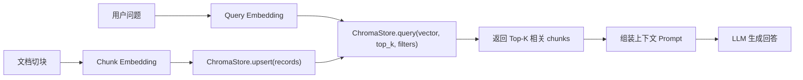

# 项目学习笔记（B7.6：ChromaStore 默认后端）

## 1) 本模块完成内容

本轮完成了 DEV_SPEC 中的 **B7.6：ChromaStore 默认后端**：

- 新增 ChromaStore 默认实现：`src/libs/vector_store/chroma_store.py`
- 在工厂默认注册 `chroma` provider：`src/libs/vector_store/vector_store_factory.py`
- 新增 roundtrip 集成测试：`tests/integration/test_chroma_store_roundtrip.py`

---

## 2) 关键知识点

### 2.1 这版 ChromaStore 的定位

- 这是面向当前学习阶段的“轻量可运行后端”。
- 核心目标是打通 `upsert → query` 主链路与持久化行为。
- 对外接口严格遵循 `BaseVectorStore` 契约。

### 2.2 持久化策略

- 默认持久化目录：`data/db/chroma`
- 可通过环境变量覆盖：`CHROMA_PERSIST_PATH`
- 存储文件：`records.json`

该策略用于保证开发/测试阶段重启后仍可读取数据，便于做 roundtrip 验证。

### 2.3 查询与过滤策略

- 相似度采用点积（dot product）做最小实现。
- 支持 `top_k` 截断。
- 支持按 `metadata` 键值做过滤（`filters`）。
- 输出结果统一包含 `chunk_id/score/text/metadata`。

### 2.4 契约与 fail-fast

- `record` 缺少必填键会立即报错。
- `vector`、`top_k`、`filters` shape 非法会立即报错。
- 持久化文件损坏时给出可读错误，避免静默异常。

### 2.5 Chroma 在 RAG 中的流程图

说明：

- 上半部分是在线查询链路（query）。
- 下半部分是离线入库链路（upsert）。
- 两条链路通过同一个 Vector Store（ChromaStore）汇合。

---

## 3) 测试与验证

- 测试文件：`tests/integration/test_chroma_store_roundtrip.py`
- 覆盖点：
  - provider=chroma 时工厂可创建
  - `upsert → query` roundtrip 正常
  - `top_k` 生效
  - `metadata filters` 生效
  - 重建实例后可读取持久化数据

执行命令：

- `python -m pytest -q -p no:cacheprovider tests/integration/test_chroma_store_roundtrip.py`
- `python -m pytest -q -p no:cacheprovider tests/unit/test_smoke_imports.py tests/unit/test_config_loading.py tests/unit/test_llm_factory.py tests/unit/test_llm_providers_smoke.py tests/unit/test_ollama_llm.py tests/unit/test_embedding_factory.py tests/unit/test_embedding_providers_smoke.py tests/unit/test_ollama_embedding.py tests/unit/test_splitter_factory.py tests/unit/test_recursive_splitter_lib.py tests/unit/test_vector_store_contract.py tests/integration/test_chroma_store_roundtrip.py tests/unit/test_reranker_factory.py tests/unit/test_custom_evaluator.py`

结果：

- B7.6 定向：`1 passed`
- 当前回归集合：`59 passed`

---

## 4) 本模块常见问题

### Q1：Chroma 是什么？

`Chroma` 是一个面向向量检索的 Vector Store。

- 它负责存储 `embedding + text + metadata`；
- 支持按向量相似度做 `top_k` 检索；
- 在 RAG 里通常承担“知识召回”的核心存储层。

### Q2：为什么这里不直接接入真正的 `chromadb` 依赖？

当前阶段目标是“默认后端可跑通 + 契约稳定 + roundtrip 可验证”。
先做轻量实现可以更快迭代，后续可在不改上层调用的前提下替换为真实 `chromadb` 后端。

### Q3：为什么 integration 测试要用临时目录？

为了保证测试隔离，避免污染项目本地数据目录。
每次测试用独立 `tmp_path`，结束后自动清理，结果更可复现。
